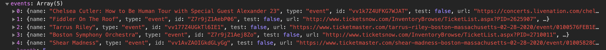

# Travel App

User puts in a date and destination for travel, and recieves weather, packing recommendations and events in the desired location

## Premise

In this busy business environment, people often have difficulty planning ahead for a vacation. Often they are making a last minute plan for a random city. This app helps them with last minute plans!

### Site repository (public)

* [Github Repository]( https://github.com/whoerman/Travel-App) -  https://github.com/whoerman/Travel-App
* [Github Page]( https://whoerman.github.io/Work-Day-Planner/) -  https://whoerman.github.io/Travel-App/

This program runs the html/css/js right on github, and all css and js references are dynamic to websites.

### Prerequisites

This program runs the html/css/js right on github, and all css and js references are dynamic to websites.

## Built With

* [VSCode](https://code.visualstudio.com/) - Editor

## APIs used for data

* [OpenCage](https://opencagedata.com/) - Source to convert city name to latitude and longitude

* [OpenWeatherMap](https://openweathermap.org/) - Source of weathter information

* [TicketMaster](https://developer.ticketmaster.com/products-and-docs/apis/discovery-api/v2/) - Source of event information


## Reference Libraries

* [Materialize](https://materializecss.com/) - Dynamic Front-end Framework library with cross-browser capabilities

* [Font Awesome](https://fontawesome.com/) - vector icons

* [Moment JS](https://momentjs.com/) - dynamic timing

* [JQuery](https://jquery.com/) - javascript library

### Use Explanation

When opened, the user is asked for a  date and a city of their choosing. When entered, the city/state are sent in an AJAX request to OpenCage API, where it is converted to latitiude and longitude in order to get more accurate data from the other two APIs.


The latitude and longitude are sent to OpenWeatherMap API, where a 5 day forecast is returned. The data from this forescast is then processed to give specific packing recommendations so one can be prepred for the weather. It also returns timezone and daylight data for the city. The traveler should run this app again right before their trip for last minute packing.



The latitude and longitude are the sent to TicketMaster API , where events are reurned for the target date and the 4 days after. This part of the app can be run at any time, and should be run early enough for planning.

```
```
### Acknowledgements

Written by Sam Delay. Tania Moore, Brian Lipsett & Walter Hoerman as part of the coursework for the UNH Full Stack Web Development Bootcamp.

